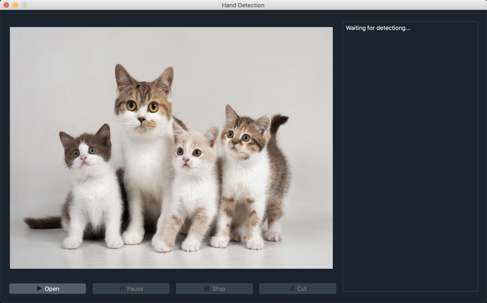
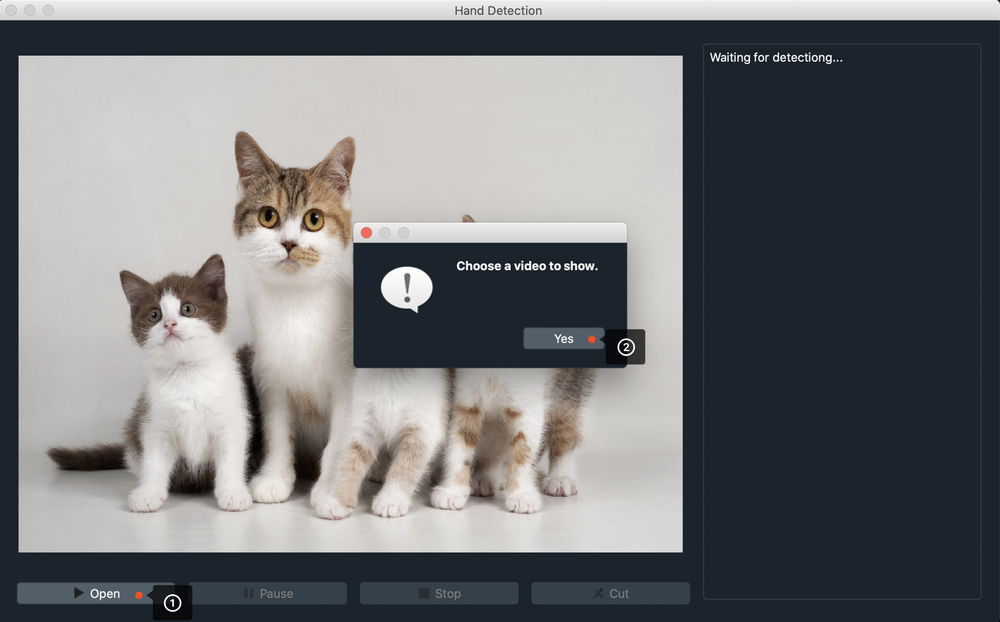
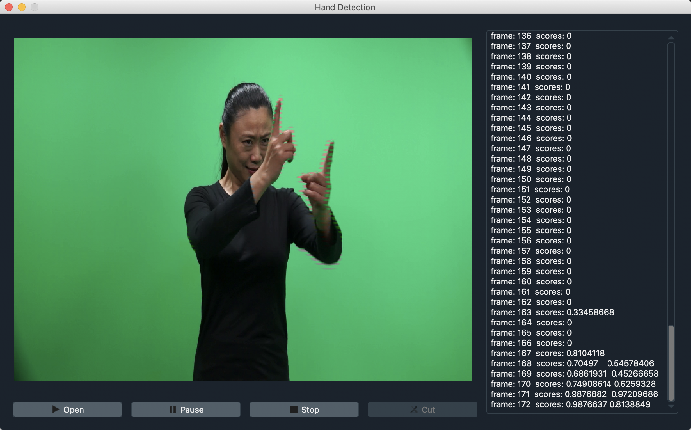
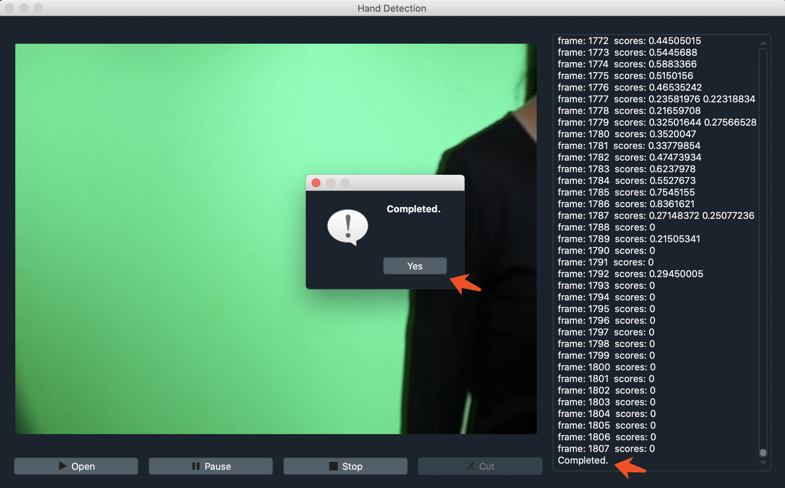
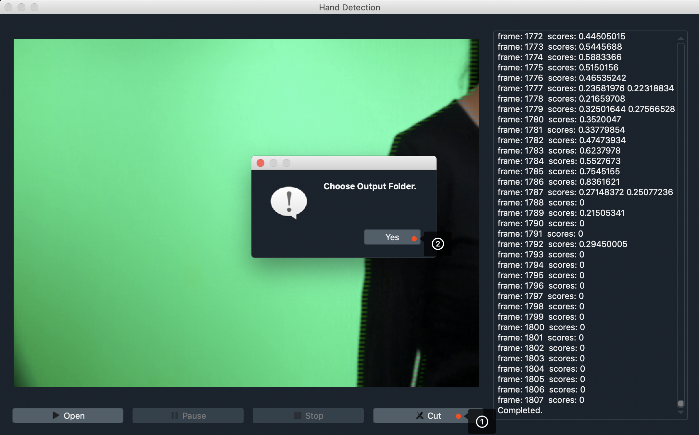
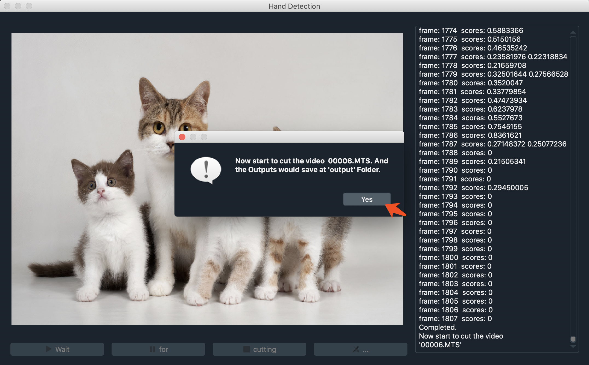
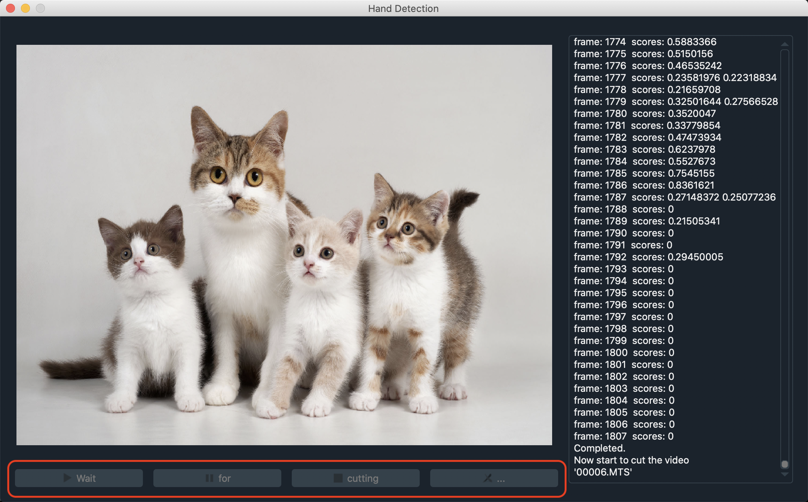
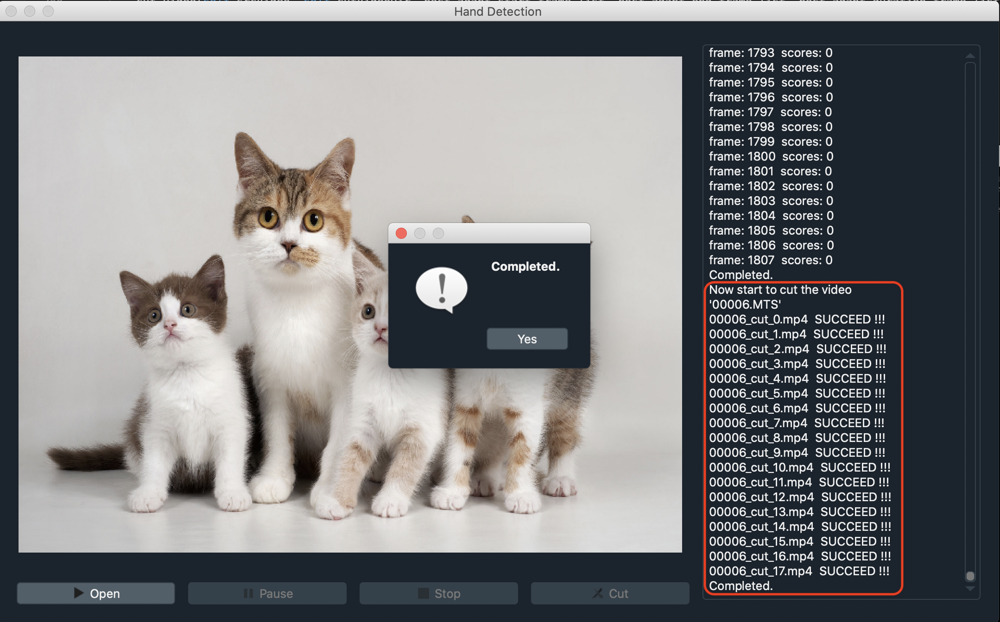

# handtracking-Application

1. Download

```shell
$ git clone https://github.com/SnorlaxSE/handtracking-Application.git
```

2. Dependency
```shell
$ cd handtracking-Application/
$ pip install -r requirement.txt
```

3. Startup


```shell
$ python detectVideo.py
```

4. Choose the Video



5. Run



* 视频选择后，检测开始；
* `Pause` 按钮 可暂停检测；
* `Stop` 按钮 可提前结束检测；



6. 视频裁剪

* 点击"Cut", 选择视频输出文件夹地址




* 视频裁剪中... (稍作等待)



* 裁剪完成



裁剪完毕后，可在上述选择的视频输出文件夹中查看裁剪的片段视频

#### 相关参考

* [handtracking](https://github.com/victordibia/handtracking)